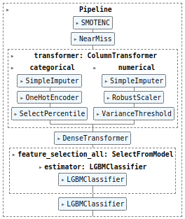
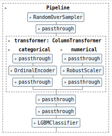
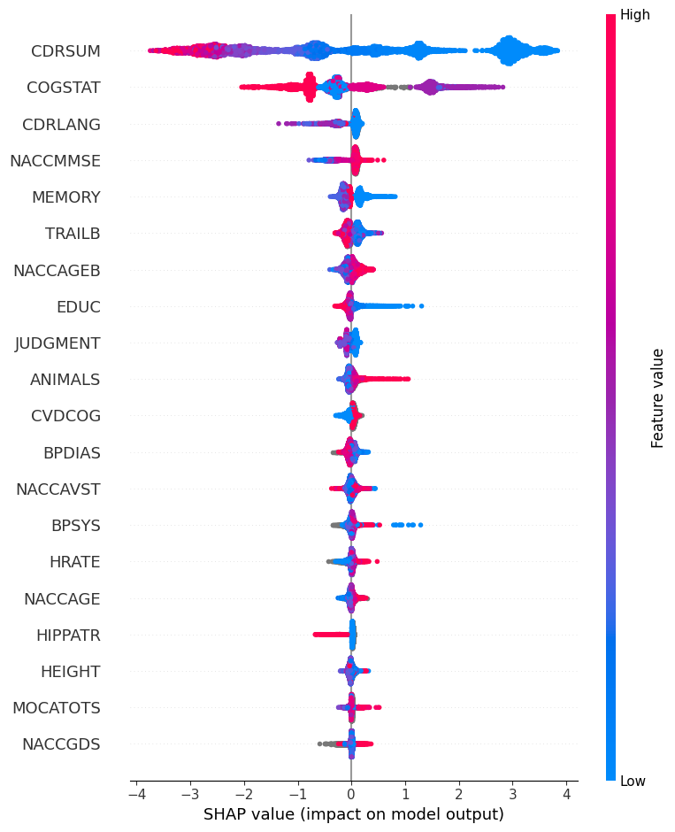
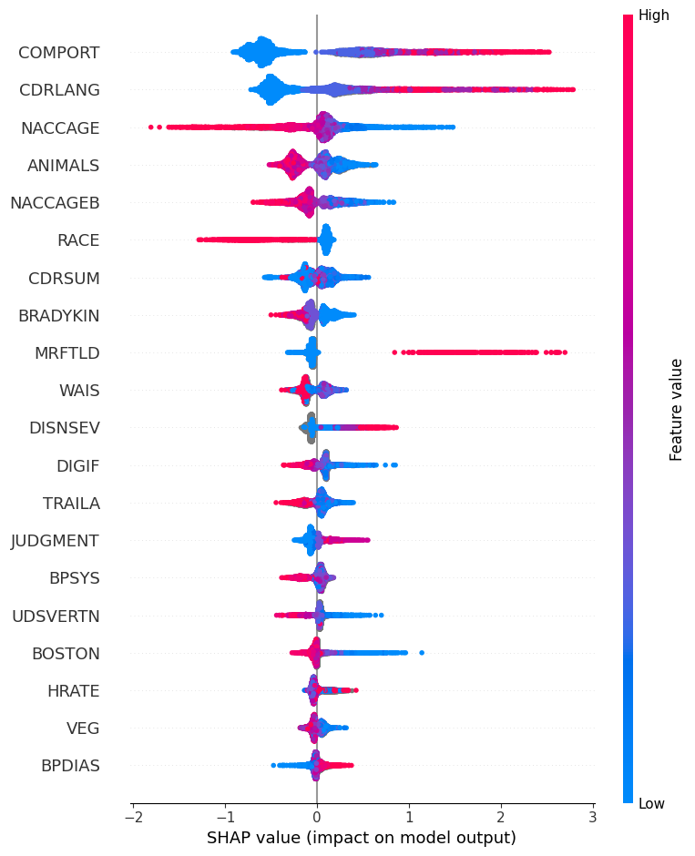
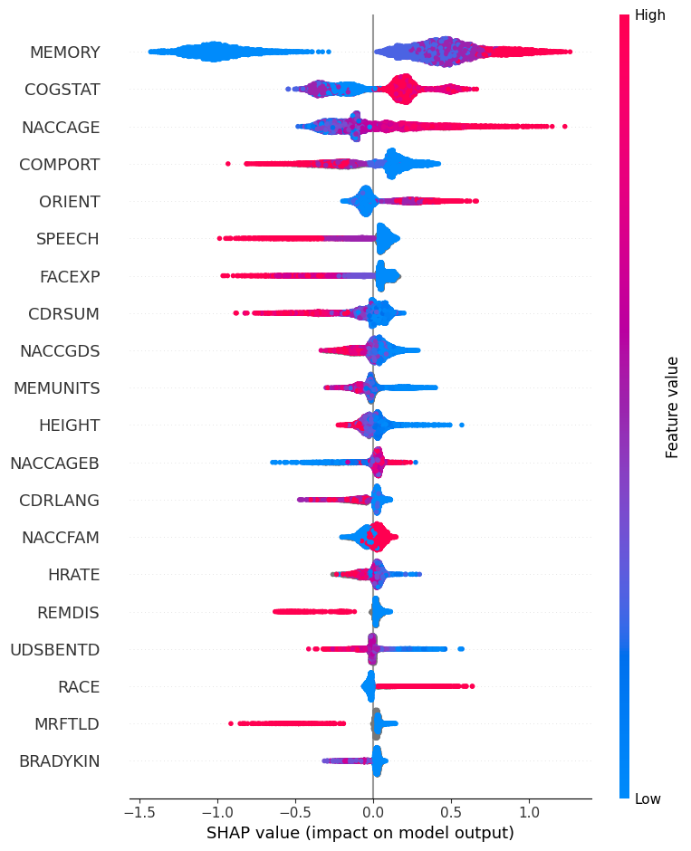
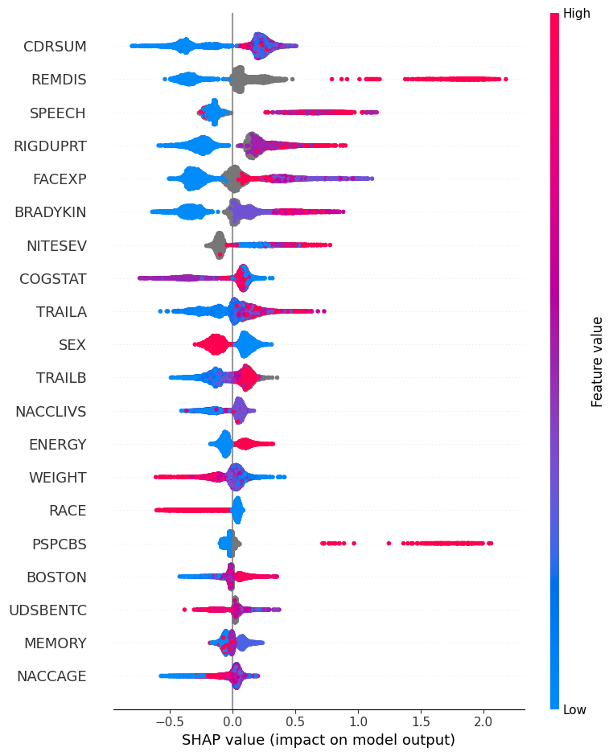
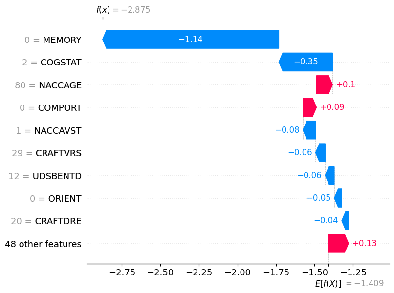
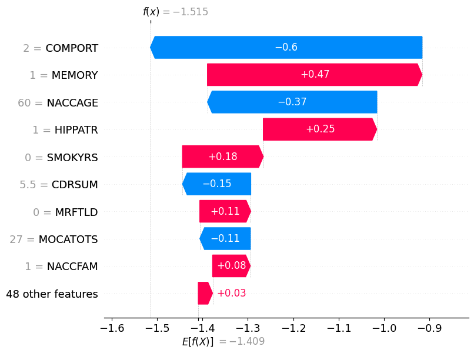
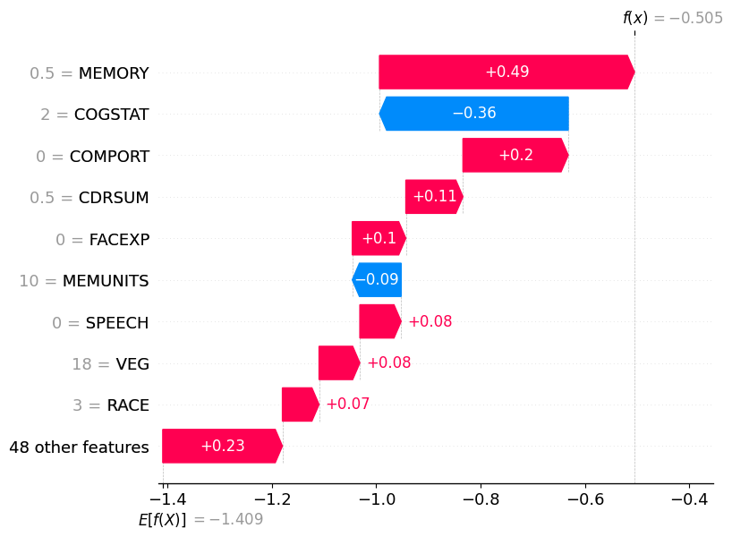
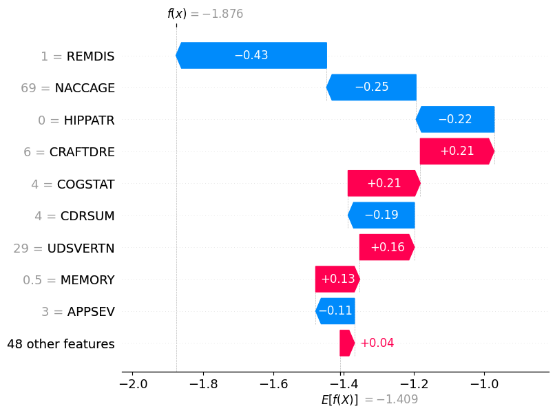

# Open Dementia Reports (ODR) - theory

This is my master's thesis where I delve in depth in the psycho and bio markers of Dementia, checking whether different types of Dementia can be diagnosed using Machine Learning. Then on top of these, I add some explainability using the Shapley method for Machine Learning. This, in principle, is a good starting ground for standardizing the Dementia Reporting for different patients, and can later become a valuable tool for clinicians. 

- [Thesis](results/Thesis.pdf)
- [Thesis, Chapter 2 - Theory](results/Chapter2.pdf)
- [Thesis, Chapter 3 - Methodology](results/Chapter3.pdf)
- [Thesis, Chapter 4 - Results](results/Chapter4.pdf)
- [Thesis, Appendix (mainly on preprocessing)](results/Appendix.pdf)
- [Notes](notes.md)

> Note: This is previous to last version, and for some reason I dont have the last version. So, some references are missing. Keep your history folks.  
> Note: the following are not updated

## Processing Units

| Subprocess        | Possible options                                                                      |
| ----------------- | ------------------------------------------------------------------------------------- |
| _Imbalance_       |                                                                                       |
| Over-sampling     | No over-sampler, `RandomOverSampler()`, `SMOTENC()`                                   |
| Under-sampling    | No under-sampler, `CustomHandler()`, `RandomUnderSampler()`, `NearMiss()`             |
| _categorical_     |                                                                                       |
| Missing data      | No imputation, `SimpleImputer(*)`                                                     |
| Transforming data | No encoding, `OneHotEncoding()`                                                       |
| Feature selection | No selection, `SelectPercentile(Chi2)`, `SelectFromModel(*)`                          |
| _numerical_       |                                                                                       |
| Missing data      | No imputation, `SimpleImputer(*)`, `KNNImputer()`, `IterativeImputer(*)`              |
| Transforming data | No scaling, `StandardScaler()`, `RobustScaler()`                                      |
| Feature selection | No selection, `VarianceThreshold`, `SelectPercentile(Pearson)` , `SelectFromModel(*)` |
| _method_          |                                                                                       |
| Classifier        | `RandomForest()`, `XGBoost()`, `LightGBM()`, `HistGradientBoostingClassifier()`       |
| Cross-Validation  | `GridSearchCV(scorer='f1_micro', cv=StratifiedGroupKFold)`                            |

<b>Table</b>: Transformers and Estimators used in the pipelines.

| Possible Pipeline                             | Sample selected Pipeline for ADNI       |
| --------------------------------------------- | --------------------------------------- |
|  |  |

> Note: In case you are using RandomForest, need to use a specific combination of preprocessing steps. To be updated.

## Results

### Best predictors for each class

For each class, the importance of the features are averaged, and then shared with the docs.

| Main predictors for big classes       | Main predictors for smaller classes   |
| ------------------------------------- | ------------------------------------- |
| (a) Healthy Controls                  | (b) Fronto-Temporal Lobe Degeneration |
|  |           |
| (c) Alzheimer's Disease               | (d) Dementia with Movement Disorders  |
|               |           |

### Single case for each class

The following are the importance of predictors for a single case. As you can see, its different from the predictors mentioned above, as the ones above are averaged among all the cases for a single class.

| Single case                           | Single case                           |
| ------------------------------------- | ------------------------------------- |
| (a) Healthy Control                   | (b) Fronto-Temporal Lobe Degeneration |
|  |           |
| (c) Alzheimer's Disease               | (d) Dementia with Movement Disorders  |
|               |           |
